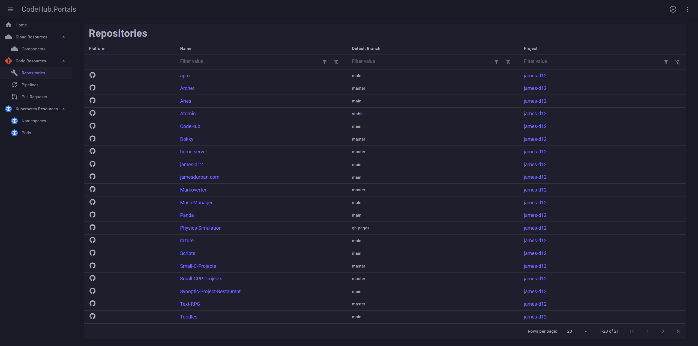

# CodeHub

A service catalog hub for viewing all of your software infrastructure from various third party providers all in one
place!

## Why?

The idea for this project came to me at work, where I often struggled to get a clear view of all the infrastructure we
had. It was frustrating to have to juggle 5+ different websites just to get the information I needed. CodeHub aims to
solve this by consolidating everything into a single, consistent UI.

## How It Works

At the moment, CodeHub works by spinning up background tasks called 'Discovery Services' that will fetch all relevant
data from your connected third parties. It then presents these via a unified portal that you can use to browse them.
It’s designed to be deployed and run locally, such as in a Kubernetes cluster or on a local machine.

## What Does The Portal Look Like?

At the moment it is in its infancy, so the UI is very basic, but below are some screenshots taken (07-12-2024) of its
current state.

## Documentation

For further information please see the READMEs for
the [backend](https://github.com/james-d12/CodeHub/blob/main/src/backend/README.md)
and [frontend](https://github.com/james-d12/CodeHub/blob/main/src/frontend/README.md) folders.

## Future Plans

- GitHub, GitLab & Bitbucket for Git providers.
- Azure / AWS for cloud providers
- SonarCloud integration for security and static analysis
- Kubernetes API integration for monitoring your orchestration stack.
